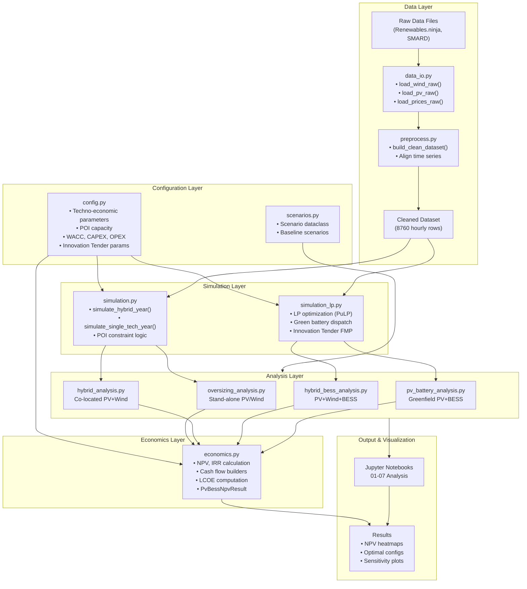
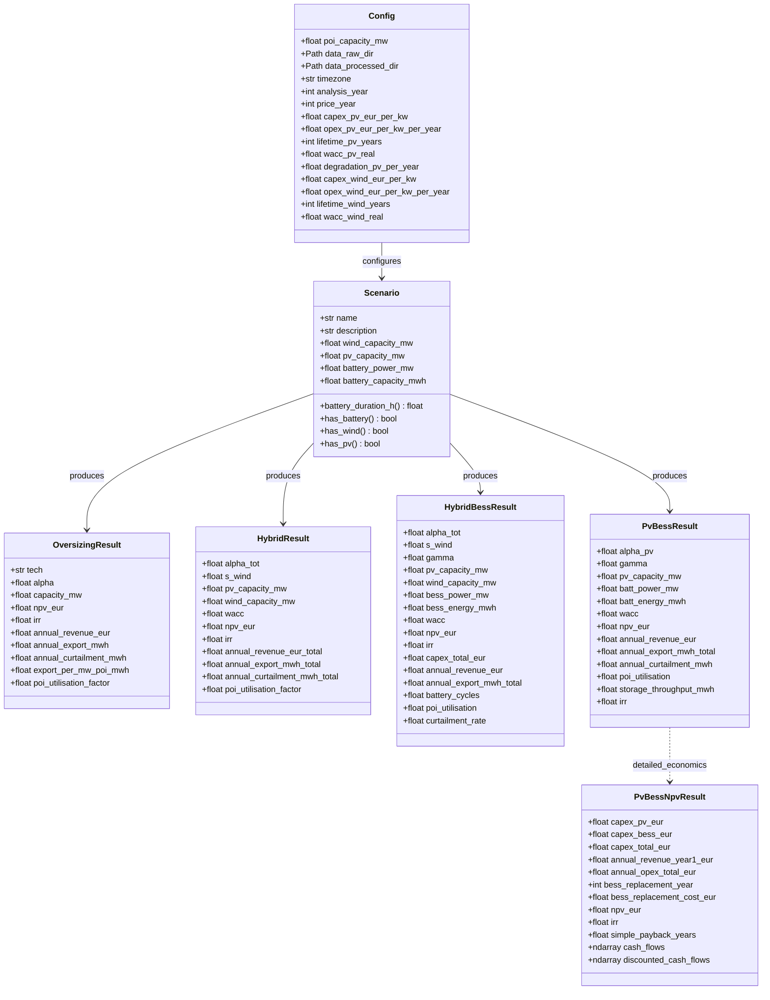
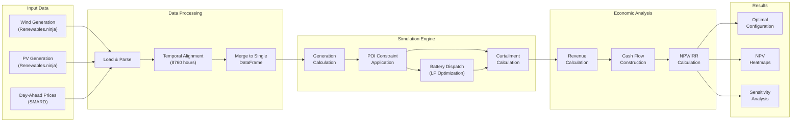
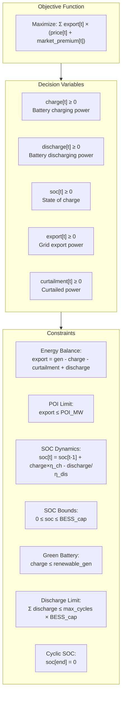
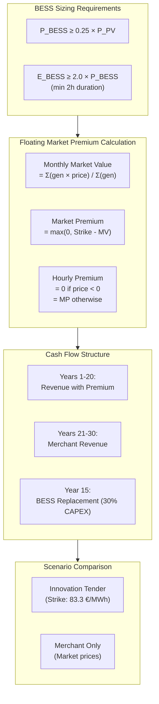
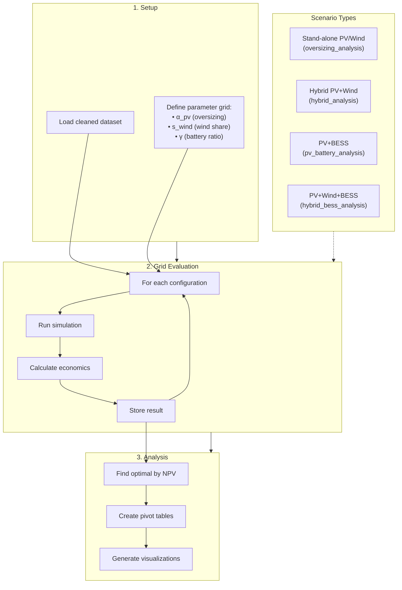

# System Architecture Diagrams

## 1. High-Level Module Architecture



## 2. Class/Dataclass Diagram



## 3. Data Flow Diagram



## 4. LP Optimization Model Structure



## 5. Innovation Tender (Innovationsausschreibung) Logic



## 6. Analysis Workflow



---

## Usage Notes

These diagrams are written in Mermaid format and can be rendered:

1. **GitHub/GitLab**: Directly in markdown files
2. **VS Code**: With Mermaid extension
3. **Mermaid Live Editor**: https://mermaid.live/
4. **Export to PDF/PNG**: Via Mermaid CLI or online tools
5. **LaTeX**: Convert to TikZ or include as image

### Export Commands (if mermaid-cli is installed)

```bash
# Install mermaid-cli
npm install -g @mermaid-js/mermaid-cli

# Export to PNG
mmdc -i architecture_diagram.md -o architecture.png -w 1600

# Export to PDF
mmdc -i architecture_diagram.md -o architecture.pdf
```
